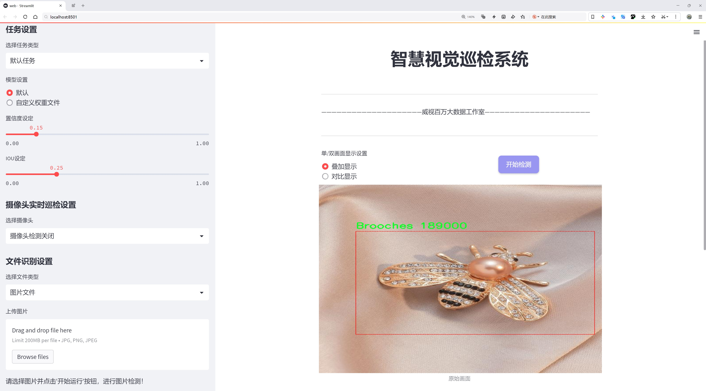
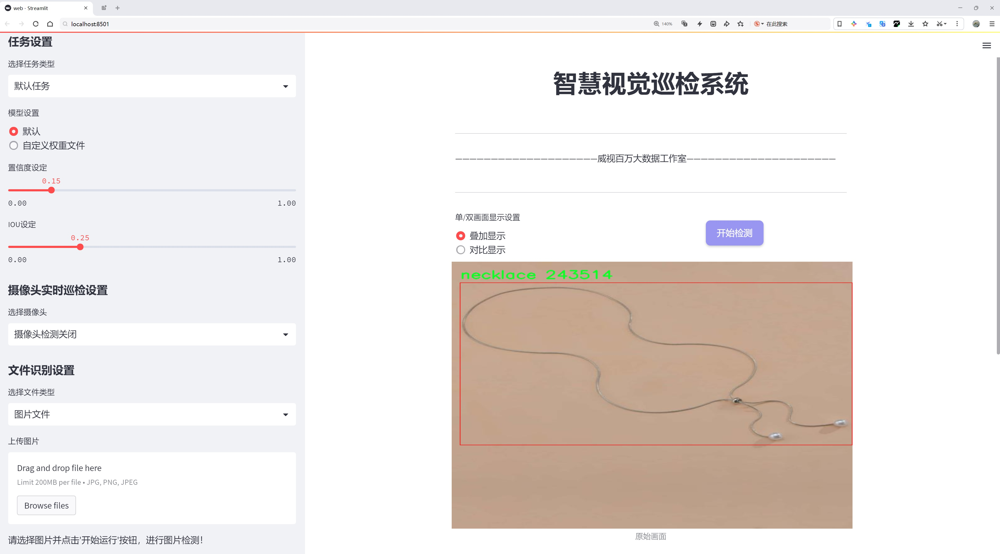
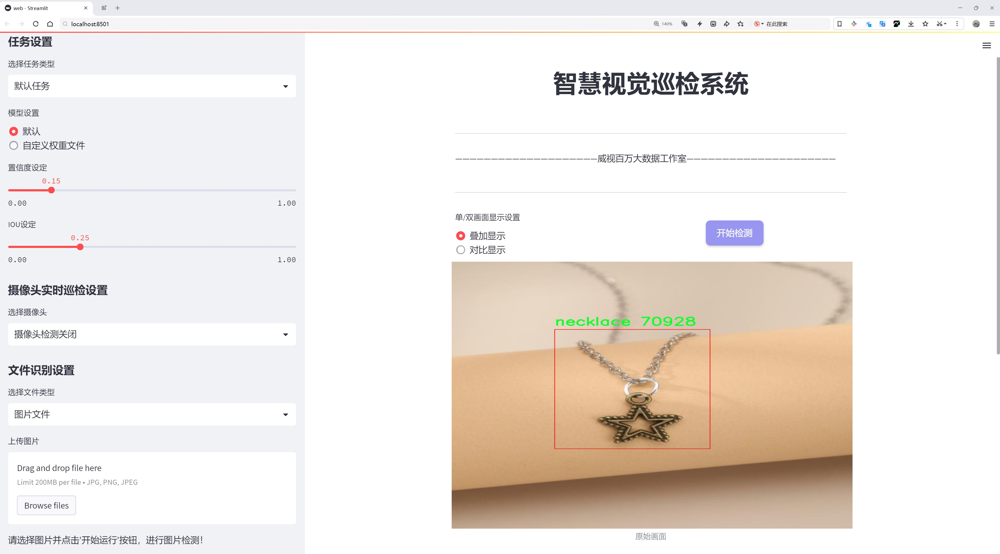
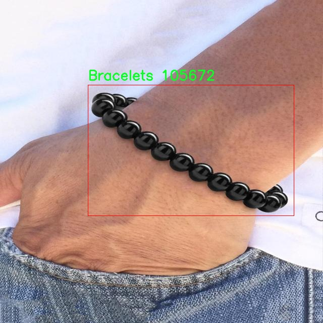
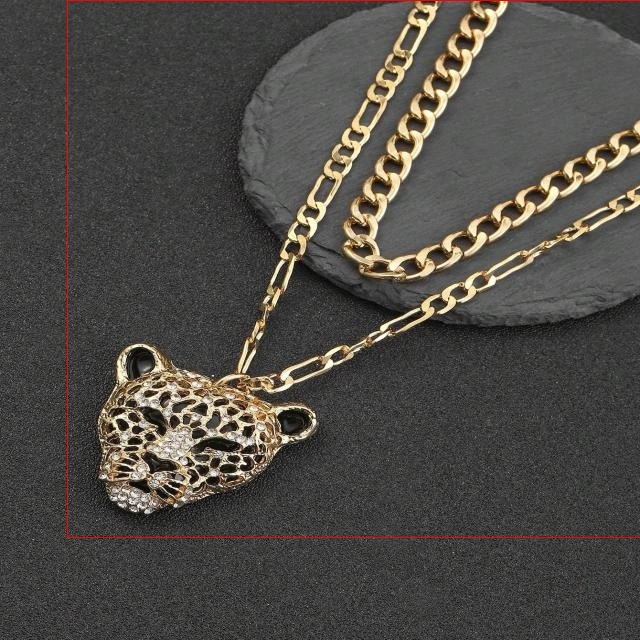
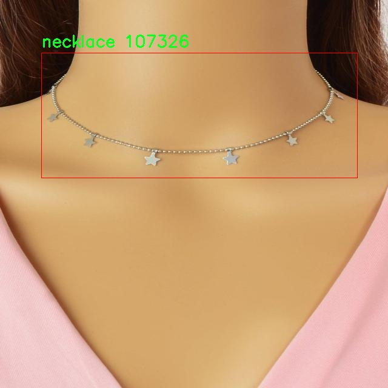
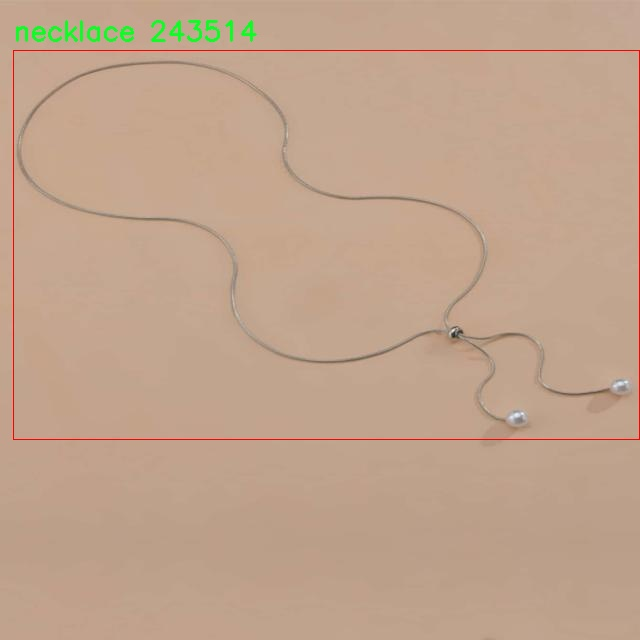

# 珠宝首饰类型检测系统源码分享
 # [一条龙教学YOLOV8标注好的数据集一键训练_70+全套改进创新点发刊_Web前端展示]

### 1.研究背景与意义

项目参考[AAAI Association for the Advancement of Artificial Intelligence](https://gitee.com/qunmasj/projects)

项目来源[AACV Association for the Advancement of Computer Vision](https://github.com/qunshansj/good)

研究背景与意义

随着社会经济的发展和人们生活水平的提高，珠宝首饰作为一种重要的装饰品，越来越受到消费者的青睐。珠宝首饰不仅仅是物质财富的象征，更是文化、艺术和个性的体现。市场上各种类型的珠宝首饰层出不穷，从手链、耳环到项链、胸针等，种类繁多，满足了不同消费者的需求。然而，随着珠宝市场的快速扩张，如何有效地对这些珠宝首饰进行分类与识别，成为了一个亟待解决的问题。

传统的珠宝首饰分类方法往往依赖于人工标注和经验判断，这不仅耗时耗力，而且容易受到主观因素的影响，导致分类结果的不准确性和不一致性。随着计算机视觉技术的快速发展，基于深度学习的目标检测算法逐渐成为解决这一问题的有效工具。YOLO（You Only Look Once）系列算法因其高效的实时检测能力和良好的准确性，广泛应用于各类物体检测任务中。特别是YOLOv8作为该系列的最新版本，结合了多种先进的技术，具有更强的特征提取能力和更快的推理速度，能够更好地适应复杂的珠宝首饰识别任务。

本研究旨在基于改进的YOLOv8模型，构建一个高效的珠宝首饰类型识别系统。我们使用的珠宝首饰数据集包含6866张图像，涵盖了9个类别，包括手链、胸针、腰带、耳环、头饰、项链、鼻环、戒指和头冠。这些类别的选择不仅反映了市场上常见的珠宝首饰类型，也为系统的多样性和实用性提供了基础。通过对这些数据的深入分析与处理，我们期望能够提高珠宝首饰的自动识别率，减少人工干预，提高工作效率。

在技术层面，本研究将针对YOLOv8模型进行改进，优化其网络结构和训练策略，以适应珠宝首饰的特征。我们将引入数据增强技术，增加数据集的多样性，提升模型的泛化能力。同时，针对珠宝首饰的特殊性，我们将设计特定的损失函数和评价指标，以更好地反映模型在实际应用中的表现。

本研究的意义不仅在于推动珠宝首饰识别技术的发展，更在于为相关行业提供一种高效、准确的解决方案。通过自动化的珠宝首饰分类与识别系统，珠宝商、设计师及消费者能够更方便地获取所需信息，提升购物体验。此外，该系统还可以为珠宝行业的库存管理、市场分析等提供数据支持，促进行业的数字化转型。

综上所述，基于改进YOLOv8的珠宝首饰类型识别系统的研究，不仅具有重要的学术价值，也具有广泛的应用前景。通过深入探讨这一领域，我们期望能够为珠宝首饰的智能化管理和个性化服务提供新的思路和方法。

### 2.图片演示







##### 注意：由于此博客编辑较早，上面“2.图片演示”和“3.视频演示”展示的系统图片或者视频可能为老版本，新版本在老版本的基础上升级如下：（实际效果以升级的新版本为准）

  （1）适配了YOLOV8的“目标检测”模型和“实例分割”模型，通过加载相应的权重（.pt）文件即可自适应加载模型。

  （2）支持“图片识别”、“视频识别”、“摄像头实时识别”三种识别模式。

  （3）支持“图片识别”、“视频识别”、“摄像头实时识别”三种识别结果保存导出，解决手动导出（容易卡顿出现爆内存）存在的问题，识别完自动保存结果并导出到tempDir中。

  （4）支持Web前端系统中的标题、背景图等自定义修改，后面提供修改教程。

  另外本项目提供训练的数据集和训练教程,暂不提供权重文件（best.pt）,需要您按照教程进行训练后实现图片演示和Web前端界面演示的效果。

### 3.视频演示

[3.1 视频演示](https://www.bilibili.com/video/BV1MHHYeWEXr/?vd_source=ff015de2d29cbe2a9cdbfa7064407a08)

### 4.数据集信息展示

数据集信息展示

在现代计算机视觉领域，数据集的质量和多样性直接影响到模型的训练效果和应用性能。为了改进YOLOv8在珠宝首饰类型识别方面的表现，我们构建了一个名为“Jewellery_detect 2”的数据集。该数据集专注于珠宝首饰的多样性和复杂性，旨在为研究人员和开发者提供一个高效的训练基础，以便更好地识别和分类不同类型的珠宝首饰。

“Jewellery_detect 2”数据集包含了九个主要类别，涵盖了广泛的珠宝首饰类型。这些类别包括手链（Bracelets）、胸针（Brooches）、腰带（belt）、耳环（earring）、头饰（maangtika）、项链（necklace）、鼻环（nose ring）、戒指（ring）以及王冠（tiara）。每个类别的选择不仅反映了珠宝首饰的多样性，也体现了不同文化和时尚潮流对珠宝设计的影响。通过对这些类别的深入分析，研究人员可以更好地理解珠宝首饰在不同场合和文化背景下的意义。

在数据集的构建过程中，我们注重数据的多样性和代表性。每个类别都包含了大量的样本，确保模型在训练时能够接触到不同风格、材质和颜色的珠宝首饰。这种多样性不仅提高了模型的泛化能力，还增强了其在实际应用中的鲁棒性。例如，手链的样本包括了金属、皮革和珠子等多种材质，而耳环则涵盖了从简单的钩式到复杂的吊坠式的多种设计。这种丰富的样本库使得模型能够在识别时更准确地捕捉到不同珠宝首饰的特征。

此外，数据集中的每个样本都经过精心标注，确保类别标签的准确性和一致性。标注过程不仅考虑了珠宝首饰的外观特征，还注重了其在图像中的位置和大小。这种精细的标注方式为模型的训练提供了坚实的基础，使其能够更好地学习到各个类别的特征和边界。

为了提高数据集的实用性，我们还考虑了数据集的可扩展性和适应性。随着珠宝设计的不断演变和新型珠宝的出现，未来可能会对数据集进行更新和扩展，以包含更多的类别和样本。这种灵活性使得“Jewellery_detect 2”不仅适用于当前的研究需求，也为未来的研究提供了可能的方向。

总之，“Jewellery_detect 2”数据集为改进YOLOv8的珠宝首饰类型识别系统提供了一个强有力的支持。通过丰富的类别、多样的样本和精确的标注，该数据集为研究人员和开发者提供了一个理想的训练平台，推动了珠宝首饰识别技术的发展。随着技术的进步和应用场景的扩展，我们期待这一数据集能够在珠宝首饰的自动识别和分类领域发挥更大的作用。










### 5.全套项目环境部署视频教程（零基础手把手教学）

[5.1 环境部署教程链接（零基础手把手教学）](https://www.ixigua.com/7404473917358506534?logTag=c807d0cbc21c0ef59de5)


[5.2 安装Python虚拟环境创建和依赖库安装视频教程链接（零基础手把手教学）](https://www.ixigua.com/7404474678003106304?logTag=1f1041108cd1f708b01a)

### 6.手把手YOLOV8训练视频教程（零基础小白有手就能学会）

[6.1 环境部署教程链接（零基础手把手教学）](https://www.ixigua.com/7404477157818401292?logTag=d31a2dfd1983c9668658)

### 7.70+种全套YOLOV8创新点代码加载调参视频教程（一键加载写好的改进模型的配置文件）

[7.1 环境部署教程链接（零基础手把手教学）](https://www.ixigua.com/7404478314661806627?logTag=29066f8288e3f4eea3a4)

### 8.70+种全套YOLOV8创新点原理讲解（非科班也可以轻松写刊发刊，V10版本正在科研待更新）

由于篇幅限制，每个创新点的具体原理讲解就不一一展开，具体见下列网址中的创新点对应子项目的技术原理博客网址【Blog】：


[8.1 70+种全套YOLOV8创新点原理讲解链接](https://gitee.com/qunmasj/good)

### 9.系统功能展示（检测对象为举例，实际内容以本项目数据集为准）

图9.1.系统支持检测结果表格显示

  图9.2.系统支持置信度和IOU阈值手动调节

  图9.3.系统支持自定义加载权重文件best.pt(需要你通过步骤5中训练获得)

  图9.4.系统支持摄像头实时识别

  图9.5.系统支持图片识别

  图9.6.系统支持视频识别

  图9.7.系统支持识别结果文件自动保存

  图9.8.系统支持Excel导出检测结果数据


### 10.原始YOLOV8算法原理

原始YOLOv8算法原理

YOLOv8算法是YOLO系列目标检测模型的最新版本，代表了深度学习领域在实时目标检测任务中的一项重要进展。该算法以其高效的检测速度和卓越的精度而受到广泛关注，尤其是在复杂场景下的应用中表现出色。YOLOv8的设计理念源于对前几代YOLO模型的深入分析与优化，旨在通过改进网络结构和算法流程来提升目标检测的整体性能。

YOLOv8的网络结构主要由四个核心部分组成：输入层、Backbone骨干网络、Neck特征融合网络和Head检测模块。输入层负责对输入图像进行预处理，包括图像缩放、Mosaic增强以及瞄点计算等操作。这些预处理步骤旨在提高模型对不同尺寸和变形目标的适应能力，从而增强后续特征提取的有效性。

在Backbone部分，YOLOv8采用了经过优化的DarkNet结构。与以往版本不同的是，YOLOv8引入了C2f模块替代了传统的C3模块。这一创新设计使得网络在特征提取过程中能够实现更丰富的梯度流动，进而提升了模型对细节特征的捕捉能力。此外，YOLOv8针对不同尺度的模型调整了通道数，以确保在轻量化的同时，依然能够保留足够的特征信息。通过SPPF模块的引入，YOLOv8能够有效地处理输出特征图，利用不同内核尺寸的池化操作来合并特征图，从而增强特征的表达能力。

在Neck部分，YOLOv8继续采用“双塔结构”，结合特征金字塔网络（FPN）和路径聚合网络（PAN），实现了对不同尺度特征的有效融合。这种结构不仅促进了语义特征与定位特征之间的转移，还进一步增强了网络对多尺度目标的检测能力。通过这样的设计，YOLOv8能够在复杂背景下更准确地识别和定位目标，提升了整体检测性能。

Head检测模块是YOLOv8的核心组成部分，采用了解耦头的结构，将回归分支和预测分支进行分离。这一设计不仅加速了模型的收敛速度，还提高了检测的精度。通过并行的卷积分支，YOLOv8能够同时计算目标的类别和位置损失，从而实现更高效的目标检测。

值得一提的是，YOLOv8还推出了轻量化版本YOLOv8n，专为资源受限的环境设计。YOLOv8n在Backbone特征提取网络层中使用了更轻量化的C2F模块，并将卷积操作优化为3×3的深度卷积，以减少计算复杂度。同时，在特征融合层中，YOLOv8n减少了降采样层的数量，进一步提升了模型的运行效率。通过引入BiFPN网络，YOLOv8n能够实现高效的双向跨尺度连接和加权特征融合，从而加快对不同尺度特征信息的提取速度。

综上所述，YOLOv8算法通过一系列结构上的创新和优化，不仅提升了目标检测的精度和速度，还增强了模型在多种应用场景下的适应能力。无论是在实时监控、自动驾驶还是智能安防等领域，YOLOv8都展现出了其强大的潜力和广泛的应用前景。随着深度学习技术的不断发展，YOLOv8无疑将成为目标检测领域的重要基石，为后续研究和应用提供了坚实的基础。


### 11.项目核心源码讲解（再也不用担心看不懂代码逻辑）

#### 11.1 ui.py

以下是对给定代码的核心部分进行提炼和详细注释的版本：

```python
import sys
import subprocess

def run_script(script_path):
    """
    使用当前 Python 环境运行指定的脚本。

    Args:
        script_path (str): 要运行的脚本路径

    Returns:
        None
    """
    # 获取当前 Python 解释器的路径
    python_path = sys.executable

    # 构建运行命令，使用 streamlit 运行指定的脚本
    command = f'"{python_path}" -m streamlit run "{script_path}"'

    # 执行命令
    result = subprocess.run(command, shell=True)
    
    # 检查命令执行结果，如果返回码不为0，则表示出错
    if result.returncode != 0:
        print("脚本运行出错。")

# 程序入口
if __name__ == "__main__":
    # 指定要运行的脚本路径
    script_path = "web.py"  # 假设脚本在当前目录下

    # 调用函数运行脚本
    run_script(script_path)
```

### 代码核心部分说明：
1. **导入模块**：
   - `sys`：用于获取当前 Python 解释器的路径。
   - `subprocess`：用于执行外部命令。

2. **`run_script` 函数**：
   - 接受一个参数 `script_path`，表示要运行的 Python 脚本的路径。
   - 使用 `sys.executable` 获取当前 Python 解释器的路径。
   - 构建一个命令字符串，用于通过 `streamlit` 运行指定的脚本。
   - 使用 `subprocess.run` 执行构建的命令，并检查返回值以确定脚本是否成功运行。

3. **程序入口**：
   - 使用 `if __name__ == "__main__":` 确保只有在直接运行该脚本时才会执行以下代码。
   - 指定要运行的脚本路径（这里假设为 `web.py`）。
   - 调用 `run_script` 函数来执行指定的脚本。 

### 注意事项：
- 该代码假设 `web.py` 脚本位于当前工作目录下，实际使用时可能需要根据具体情况调整路径。
- 需要确保系统中已安装 `streamlit`，否则脚本将无法正常运行。

这个程序文件 `ui.py` 的主要功能是运行一个指定的 Python 脚本，具体来说是使用 Streamlit 框架来启动一个 Web 应用。程序首先导入了必要的模块，包括 `sys`、`os` 和 `subprocess`，这些模块提供了与系统交互和执行外部命令的功能。此外，还导入了 `abs_path` 函数，用于获取文件的绝对路径。

在 `run_script` 函数中，程序接受一个参数 `script_path`，这是要运行的脚本的路径。函数内部首先获取当前 Python 解释器的路径，这通过 `sys.executable` 实现。接着，构建一个命令字符串，该命令使用当前的 Python 解释器来运行指定的脚本，并通过 Streamlit 启动它。命令的格式是 `"{python_path}" -m streamlit run "{script_path}"`，其中 `python_path` 和 `script_path` 分别是当前 Python 解释器的路径和要运行的脚本的路径。

随后，程序使用 `subprocess.run` 方法来执行这个命令。`shell=True` 参数允许在 shell 中执行命令。执行完命令后，程序检查返回的结果，如果返回码不为 0，表示脚本运行过程中出现了错误，程序会打印出相应的错误信息。

在文件的最后部分，使用 `if __name__ == "__main__":` 语句来确保只有在直接运行该脚本时才会执行后面的代码。这里指定了要运行的脚本路径 `web.py`，并调用 `run_script` 函数来启动这个脚本。

总的来说，这个文件的作用是为用户提供一个简单的接口，通过命令行运行一个 Streamlit Web 应用，方便用户进行 Web 应用的开发和测试。

#### 11.2 ultralytics\models\fastsam\prompt.py

以下是经过简化和注释的核心代码部分，主要集中在图像分割和结果处理的功能上：

```python
import os
import numpy as np
import torch
from PIL import Image
import cv2
from ultralytics.utils import TQDM

class FastSAMPrompt:
    """
    Fast Segment Anything Model 类，用于图像注释和可视化。

    属性:
        device (str): 计算设备（'cuda' 或 'cpu'）。
        results: 目标检测或分割结果。
        source: 源图像或图像路径。
        clip: 用于线性分配的 CLIP 模型。
    """

    def __init__(self, source, results, device="cuda") -> None:
        """初始化 FastSAMPrompt，设置源图像、结果和设备，并导入 CLIP 模型。"""
        self.device = device
        self.results = results
        self.source = source

        # 导入并分配 CLIP 模型
        try:
            import clip  # 用于线性分配
        except ImportError:
            from ultralytics.utils.checks import check_requirements
            check_requirements("git+https://github.com/openai/CLIP.git")
            import clip
        self.clip = clip

    @staticmethod
    def _segment_image(image, bbox):
        """根据提供的边界框坐标对给定图像进行分割。"""
        image_array = np.array(image)
        segmented_image_array = np.zeros_like(image_array)
        x1, y1, x2, y2 = bbox
        segmented_image_array[y1:y2, x1:x2] = image_array[y1:y2, x1:x2]
        segmented_image = Image.fromarray(segmented_image_array)
        black_image = Image.new("RGB", image.size, (255, 255, 255))
        transparency_mask = np.zeros((image_array.shape[0], image_array.shape[1]), dtype=np.uint8)
        transparency_mask[y1:y2, x1:x2] = 255
        transparency_mask_image = Image.fromarray(transparency_mask, mode="L")
        black_image.paste(segmented_image, mask=transparency_mask_image)
        return black_image

    @staticmethod
    def _format_results(result, filter=0):
        """将检测结果格式化为包含 ID、分割、边界框、分数和面积的注释列表。"""
        annotations = []
        n = len(result.masks.data) if result.masks is not None else 0
        for i in range(n):
            mask = result.masks.data[i] == 1.0
            if torch.sum(mask) >= filter:
                annotation = {
                    "id": i,
                    "segmentation": mask.cpu().numpy(),
                    "bbox": result.boxes.data[i],
                    "score": result.boxes.conf[i],
                }
                annotation["area"] = annotation["segmentation"].sum()
                annotations.append(annotation)
        return annotations

    def plot(self, annotations, output):
        """
        在图像上绘制注释、边界框，并保存输出。

        参数:
            annotations (list): 要绘制的注释。
            output (str or Path): 保存绘图的输出目录。
        """
        pbar = TQDM(annotations, total=len(annotations))
        for ann in pbar:
            result_name = os.path.basename(ann.path)
            image = ann.orig_img[..., ::-1]  # BGR 转 RGB
            original_h, original_w = ann.orig_shape
            plt.figure(figsize=(original_w / 100, original_h / 100))
            plt.subplots_adjust(top=1, bottom=0, right=1, left=0, hspace=0, wspace=0)
            plt.margins(0, 0)
            plt.gca().xaxis.set_major_locator(plt.NullLocator())
            plt.gca().yaxis.set_major_locator(plt.NullLocator())
            plt.imshow(image)

            if ann.masks is not None:
                masks = ann.masks.data
                for i, mask in enumerate(masks):
                    mask = cv2.morphologyEx(mask.astype(np.uint8), cv2.MORPH_CLOSE, np.ones((3, 3), np.uint8))
                    masks[i] = cv2.morphologyEx(mask.astype(np.uint8), cv2.MORPH_OPEN, np.ones((8, 8), np.uint8))

                self.fast_show_mask(masks, plt.gca())

            # 保存图像
            save_path = Path(output) / result_name
            save_path.parent.mkdir(exist_ok=True, parents=True)
            plt.axis("off")
            plt.savefig(save_path, bbox_inches="tight", pad_inches=0, transparent=True)
            plt.close()
            pbar.set_description(f"Saving {result_name} to {save_path}")

    @staticmethod
    def fast_show_mask(annotation, ax):
        """
        快速在给定的 matplotlib 轴上显示掩码注释。

        参数:
            annotation (array-like): 掩码注释。
            ax (matplotlib.axes.Axes): Matplotlib 轴。
        """
        n, h, w = annotation.shape  # 批量，高度，宽度
        areas = np.sum(annotation, axis=(1, 2))
        annotation = annotation[np.argsort(areas)]

        index = (annotation != 0).argmax(axis=0)
        color = np.random.random((n, 1, 1, 3))  # 随机颜色
        transparency = np.ones((n, 1, 1, 1)) * 0.6
        visual = np.concatenate([color, transparency], axis=-1)
        mask_image = np.expand_dims(annotation, -1) * visual

        show = np.zeros((h, w, 4))
        h_indices, w_indices = np.meshgrid(np.arange(h), np.arange(w), indexing="ij")
        indices = (index[h_indices, w_indices], h_indices, w_indices, slice(None))

        show[h_indices, w_indices, :] = mask_image[indices]
        ax.imshow(show)

    @torch.no_grad()
    def retrieve(self, model, preprocess, elements, search_text: str, device) -> int:
        """处理图像和文本，计算相似度，并返回 softmax 分数。"""
        preprocessed_images = [preprocess(image).to(device) for image in elements]
        tokenized_text = self.clip.tokenize([search_text]).to(device)
        stacked_images = torch.stack(preprocessed_images)
        image_features = model.encode_image(stacked_images)
        text_features = model.encode_text(tokenized_text)
        image_features /= image_features.norm(dim=-1, keepdim=True)
        text_features /= text_features.norm(dim=-1, keepdim=True)
        probs = 100.0 * image_features @ text_features.T
        return probs[:, 0].softmax(dim=0)

    def everything_prompt(self):
        """返回类中处理后的结果。"""
        return self.results
```

### 代码说明：
1. **类的定义**：`FastSAMPrompt`类用于处理图像分割和注释，包含多个方法来实现不同的功能。
2. **初始化方法**：在初始化时设置设备、源图像和结果，并导入CLIP模型。
3. **图像分割**：`_segment_image`方法根据给定的边界框从图像中提取出对应的区域。
4. **结果格式化**：`_format_results`方法将检测结果转换为包含注释信息的列表。
5. **绘图方法**：`plot`方法在图像上绘制分割掩码和边界框，并保存结果。
6. **快速显示掩码**：`fast_show_mask`方法用于在指定的matplotlib轴上快速显示掩码。
7. **检索功能**：`retrieve`方法用于处理图像和文本，计算它们之间的相似度。
8. **返回结果**：`everything_prompt`方法返回处理后的结果。

这个程序文件定义了一个名为 `FastSAMPrompt` 的类，主要用于图像注释和可视化，结合了图像分割和文本提示的功能。该类的构造函数接受源图像、检测结果和计算设备（如 CPU 或 GPU）作为参数，并尝试导入 CLIP 模型以进行线性分配。

类中包含多个静态方法和实例方法。静态方法 `_segment_image` 用于根据给定的边界框坐标对图像进行分割，生成一个带有透明区域的图像。`_format_results` 方法将检测结果格式化为包含 ID、分割掩码、边界框、置信度和面积的注释列表。`_get_bbox_from_mask` 方法则通过形态学变换从掩码中提取边界框。

`plot` 方法用于在图像上绘制注释、边界框和点，并将结果保存到指定的输出目录。该方法使用 `TQDM` 进行进度条显示，并通过 Matplotlib 绘制图像。它还可以选择性地应用形态学变换以提高掩码质量，并绘制轮廓。

`fast_show_mask` 方法用于快速显示掩码注释。它将掩码转换为可视化格式，并在指定的 Matplotlib 轴上绘制。`retrieve` 方法则处理图像和文本，计算相似度并返回软最大值分数。

类中还包含 `_crop_image` 方法，用于根据提供的注释格式裁剪图像，并返回裁剪后的图像和相关数据。`box_prompt` 和 `point_prompt` 方法分别用于根据用户输入的边界框和点调整掩码，并返回修改后的结果。`text_prompt` 方法处理文本提示，将其应用于现有结果并返回更新后的结果。最后，`everything_prompt` 方法返回类中处理后的结果。

整体来看，这个类提供了一种灵活的方式来处理图像分割和注释，结合了用户输入的边界框、点和文本提示，以便更好地调整和优化分割结果。

#### 11.3 ultralytics\nn\__init__.py

```python
# 导入必要的模型和函数
from .tasks import (
    BaseModel,               # 基础模型类
    ClassificationModel,     # 分类模型类
    DetectionModel,          # 检测模型类
    SegmentationModel,       # 分割模型类
    attempt_load_one_weight, # 尝试加载单个权重
    attempt_load_weights,    # 尝试加载多个权重
    guess_model_scale,       # 猜测模型的缩放比例
    guess_model_task,        # 猜测模型的任务类型
    parse_model,             # 解析模型
    torch_safe_load,         # 安全加载PyTorch模型
    yaml_model_load,         # 从YAML文件加载模型
)

# 定义模块的公开接口
__all__ = (
    "attempt_load_one_weight", # 公开加载单个权重的函数
    "attempt_load_weights",     # 公开加载多个权重的函数
    "parse_model",              # 公开解析模型的函数
    "yaml_model_load",          # 公开从YAML文件加载模型的函数
    "guess_model_task",         # 公开猜测模型任务的函数
    "guess_model_scale",        # 公开猜测模型缩放比例的函数
    "torch_safe_load",          # 公开安全加载PyTorch模型的函数
    "DetectionModel",           # 公开检测模型类
    "SegmentationModel",        # 公开分割模型类
    "ClassificationModel",      # 公开分类模型类
    "BaseModel",                # 公开基础模型类
)
```

### 注释说明：
1. **导入部分**：从`tasks`模块中导入了多个模型类和函数，这些是实现YOLO模型所需的核心组件。
2. **模型类**：
   - `BaseModel`：所有模型的基础类，提供基本功能。
   - `ClassificationModel`：用于图像分类的模型类。
   - `DetectionModel`：用于目标检测的模型类。
   - `SegmentationModel`：用于图像分割的模型类。
3. **函数**：
   - `attempt_load_one_weight`：尝试加载单个模型权重。
   - `attempt_load_weights`：尝试加载多个模型权重。
   - `guess_model_scale`：根据输入猜测模型的缩放比例。
   - `guess_model_task`：根据输入猜测模型的任务类型（分类、检测或分割）。
   - `parse_model`：解析模型结构。
   - `torch_safe_load`：安全地加载PyTorch模型，避免潜在的错误。
   - `yaml_model_load`：从YAML文件中加载模型配置。
4. **`__all__`**：定义了模块的公开接口，指定了哪些类和函数可以被外部访问。这样做可以控制模块的可用性，避免不必要的暴露。

这个程序文件是Ultralytics YOLO（You Only Look Once）项目的一部分，使用AGPL-3.0许可证进行发布。文件的主要功能是导入与模型相关的任务和功能，并定义了一个公共接口。

在文件的开头，首先有一个注释，表明这是Ultralytics YOLO项目，并且说明了其许可证类型。接下来，程序从同一目录下的`tasks`模块中导入了一系列的类和函数。这些导入的内容包括：

- `BaseModel`：可能是所有模型的基类，提供一些通用的功能。
- `ClassificationModel`：用于分类任务的模型。
- `DetectionModel`：用于目标检测任务的模型。
- `SegmentationModel`：用于图像分割任务的模型。
- `attempt_load_one_weight`：尝试加载单个权重文件的函数。
- `attempt_load_weights`：尝试加载多个权重文件的函数。
- `guess_model_scale`：根据某些标准推测模型的规模。
- `guess_model_task`：根据模型的特征推测其任务类型。
- `parse_model`：解析模型的结构或配置。
- `torch_safe_load`：安全地加载PyTorch模型的函数。
- `yaml_model_load`：从YAML文件中加载模型的函数。

最后，文件定义了`__all__`变量，这个变量是一个元组，列出了在使用`from module import *`语句时希望导出的公共接口内容。通过定义`__all__`，可以控制哪些类和函数是模块的公共部分，便于其他模块或用户使用。

总的来说，这个文件的作用是组织和暴露与YOLO模型相关的功能和类，方便其他部分的代码进行调用和使用。

#### 11.4 train.py

以下是代码中最核心的部分，并附上详细的中文注释：

```python
import os
import torch
import yaml
from ultralytics import YOLO  # 导入YOLO模型库
from QtFusion.path import abs_path  # 导入路径处理函数

# 设置设备为GPU（如果可用），否则使用CPU
device = "0" if torch.cuda.is_available() else "cpu"

if __name__ == '__main__':  # 确保该模块被直接运行时才执行以下代码
    workers = 1  # 设置数据加载的工作进程数
    batch = 2    # 设置每个批次的大小

    data_name = "data"  # 数据集名称
    # 获取数据集yaml文件的绝对路径
    data_path = abs_path(f'datasets/{data_name}/{data_name}.yaml', path_type='current')  
    unix_style_path = data_path.replace(os.sep, '/')  # 将路径格式转换为Unix风格

    # 获取数据集目录路径
    directory_path = os.path.dirname(unix_style_path)
    
    # 读取YAML文件，保持原有顺序
    with open(data_path, 'r') as file:
        data = yaml.load(file, Loader=yaml.FullLoader)
    
    # 如果YAML文件中存在'path'项，则修改为当前目录路径
    if 'path' in data:
        data['path'] = directory_path
        # 将修改后的数据写回YAML文件
        with open(data_path, 'w') as file:
            yaml.safe_dump(data, file, sort_keys=False)

    # 加载预训练的YOLOv8模型
    model = YOLO(model='./ultralytics/cfg/models/v8/yolov8s.yaml', task='detect')  
    
    # 开始训练模型
    results2 = model.train(  
        data=data_path,  # 指定训练数据的配置文件路径
        device=device,  # 使用指定的设备进行训练
        workers=workers,  # 使用指定数量的工作进程加载数据
        imgsz=640,  # 指定输入图像的大小为640x640
        epochs=100,  # 指定训练100个epoch
        batch=batch,  # 指定每个批次的大小
        name='train_v8_' + data_name  # 指定训练任务的名称
    )
```

### 代码核心部分说明：
1. **设备选择**：根据是否有可用的GPU来选择训练设备。
2. **数据集路径处理**：读取指定的数据集配置文件（YAML格式），并确保其中的路径项正确指向数据集所在目录。
3. **模型加载**：加载YOLOv8的预训练模型，以便进行目标检测任务。
4. **模型训练**：调用模型的训练方法，传入数据集路径、设备、工作进程数、图像大小、训练轮数和批次大小等参数，开始训练过程。

这个程序文件`train.py`的主要功能是使用YOLO（You Only Look Once）模型进行目标检测的训练。首先，程序导入了必要的库，包括`os`、`torch`、`yaml`和`ultralytics`中的YOLO模型。接着，程序通过检查CUDA是否可用来决定使用GPU还是CPU进行训练。

在`__main__`模块中，程序设置了一些训练参数，如工作进程数和批次大小。接下来，程序定义了数据集的名称，并构建了数据集配置文件的绝对路径。使用`abs_path`函数，程序获取到数据集的yaml文件的绝对路径，并将路径中的分隔符统一为Unix风格。

然后，程序读取该yaml文件，保持原有的顺序。特别地，如果yaml文件中包含`path`项，程序会将其修改为数据集所在目录的路径，并将修改后的内容写回到yaml文件中。这一步确保了YOLO模型能够正确找到训练数据。

接下来，程序加载了YOLOv8的预训练模型，指定了模型的配置文件。然后，调用`model.train()`方法开始训练模型。在训练过程中，程序指定了多个参数，包括训练数据的配置文件路径、设备类型、工作进程数、输入图像的大小（640x640）、训练的epoch数量（100）以及每个批次的大小（2）。最后，训练任务的名称被设置为`train_v8_`加上数据集的名称。

总体而言，这个程序实现了YOLOv8模型的训练过程，包括数据准备、模型加载和训练参数的设置。

#### 11.5 ultralytics\models\sam\build.py

以下是经过简化和注释的核心代码部分：

```python
import torch
from functools import partial
from ultralytics.utils.downloads import attempt_download_asset
from .modules.decoders import MaskDecoder
from .modules.encoders import ImageEncoderViT, PromptEncoder
from .modules.sam import Sam
from .modules.tiny_encoder import TinyViT
from .modules.transformer import TwoWayTransformer

def _build_sam(encoder_embed_dim, encoder_depth, encoder_num_heads, encoder_global_attn_indexes, checkpoint=None, mobile_sam=False):
    """构建选定的SAM模型架构。"""
    
    # 定义一些基本参数
    prompt_embed_dim = 256  # 提示嵌入维度
    image_size = 1024  # 输入图像大小
    vit_patch_size = 16  # ViT的补丁大小
    image_embedding_size = image_size // vit_patch_size  # 图像嵌入大小

    # 根据是否为移动版本选择不同的图像编码器
    image_encoder = (
        TinyViT(
            img_size=image_size,
            in_chans=3,
            num_classes=1000,
            embed_dims=encoder_embed_dim,
            depths=encoder_depth,
            num_heads=encoder_num_heads,
            window_sizes=[7, 7, 14, 7],
            mlp_ratio=4.0,
            drop_rate=0.0,
            drop_path_rate=0.0,
            use_checkpoint=False,
            mbconv_expand_ratio=4.0,
            local_conv_size=3,
            layer_lr_decay=0.8,
        ) if mobile_sam else ImageEncoderViT(
            depth=encoder_depth,
            embed_dim=encoder_embed_dim,
            img_size=image_size,
            mlp_ratio=4,
            norm_layer=partial(torch.nn.LayerNorm, eps=1e-6),
            num_heads=encoder_num_heads,
            patch_size=vit_patch_size,
            qkv_bias=True,
            use_rel_pos=True,
            global_attn_indexes=encoder_global_attn_indexes,
            window_size=14,
            out_chans=prompt_embed_dim,
        )
    )

    # 创建SAM模型实例
    sam = Sam(
        image_encoder=image_encoder,
        prompt_encoder=PromptEncoder(
            embed_dim=prompt_embed_dim,
            image_embedding_size=(image_embedding_size, image_embedding_size),
            input_image_size=(image_size, image_size),
            mask_in_chans=16,
        ),
        mask_decoder=MaskDecoder(
            num_multimask_outputs=3,
            transformer=TwoWayTransformer(
                depth=2,
                embedding_dim=prompt_embed_dim,
                mlp_dim=2048,
                num_heads=8,
            ),
            transformer_dim=prompt_embed_dim,
            iou_head_depth=3,
            iou_head_hidden_dim=256,
        ),
        pixel_mean=[123.675, 116.28, 103.53],  # 像素均值
        pixel_std=[58.395, 57.12, 57.375],  # 像素标准差
    )

    # 如果提供了检查点，则加载模型权重
    if checkpoint is not None:
        checkpoint = attempt_download_asset(checkpoint)  # 尝试下载检查点
        with open(checkpoint, "rb") as f:
            state_dict = torch.load(f)  # 加载权重
        sam.load_state_dict(state_dict)  # 应用权重
    sam.eval()  # 设置模型为评估模式
    return sam  # 返回构建的模型

def build_sam(ckpt="sam_b.pt"):
    """根据指定的ckpt构建SAM模型。"""
    model_builder = None
    ckpt = str(ckpt)  # 将ckpt转换为字符串，以支持Path类型
    for k in sam_model_map.keys():
        if ckpt.endswith(k):
            model_builder = sam_model_map.get(k)  # 获取对应的模型构建函数

    if not model_builder:
        raise FileNotFoundError(f"{ckpt} 不是支持的SAM模型。可用模型有: \n {sam_model_map.keys()}")

    return model_builder(ckpt)  # 返回构建的模型
```

### 代码说明：
1. **导入模块**：导入必要的库和模块，包括PyTorch和自定义的模块。
2. **_build_sam函数**：这是构建SAM模型的核心函数，接受多个参数来定义模型的结构和特性。
   - **参数**：
     - `encoder_embed_dim`：编码器的嵌入维度。
     - `encoder_depth`：编码器的深度。
     - `encoder_num_heads`：编码器的头数。
     - `encoder_global_attn_indexes`：全局注意力索引。
     - `checkpoint`：可选的检查点路径，用于加载预训练权重。
     - `mobile_sam`：布尔值，指示是否构建移动版本的SAM。
   - **模型构建**：根据参数创建图像编码器和SAM模型实例。
   - **权重加载**：如果提供了检查点，则尝试下载并加载模型权重。
3. **build_sam函数**：根据给定的检查点名称构建相应的SAM模型，确保检查点是有效的，并返回构建的模型。

这个程序文件的主要功能是构建和返回不同大小的“Segment Anything Model”（SAM）模型。文件首先导入了一些必要的库和模块，包括 PyTorch 和一些自定义的模块。接下来，定义了一些函数来构建不同配置的 SAM 模型，包括高（h）、大（l）、中（b）和移动版（Mobile-SAM）模型。

每个构建函数（如 `build_sam_vit_h`、`build_sam_vit_l`、`build_sam_vit_b` 和 `build_mobile_sam`）都调用了一个内部函数 `_build_sam`，并传递特定的参数，如编码器的嵌入维度、深度、头数和全局注意力索引。这些参数决定了模型的结构和复杂性。

`_build_sam` 函数是构建 SAM 模型的核心部分。它根据传入的参数选择合适的图像编码器（可以是 `TinyViT` 或 `ImageEncoderViT`），并创建一个 SAM 实例。该实例包括图像编码器、提示编码器和掩码解码器等组件。掩码解码器使用了一个双向变换器来处理多掩码输出。

如果提供了检查点（checkpoint），函数会尝试下载并加载模型的权重。最后，模型被设置为评估模式，并返回构建好的模型实例。

在文件的最后，定义了一个字典 `sam_model_map`，将模型文件名映射到相应的构建函数。`build_sam` 函数根据给定的检查点名称查找并调用相应的构建函数，如果找不到对应的模型，则抛出一个文件未找到的异常。

总体来说，这个文件实现了一个灵活的框架，用于构建和加载不同配置的 SAM 模型，适用于图像分割等任务。

#### 11.6 ultralytics\models\utils\loss.py

以下是代码中最核心的部分，并附上详细的中文注释：

```python
import torch
import torch.nn as nn
import torch.nn.functional as F
from ultralytics.utils.loss import FocalLoss, VarifocalLoss
from ultralytics.utils.metrics import bbox_iou
from .ops import HungarianMatcher

class DETRLoss(nn.Module):
    """
    DETR (DEtection TRansformer) 损失类。该类计算并返回DETR目标检测模型的不同损失组件。
    计算分类损失、边界框损失、GIoU损失，以及可选的辅助损失。
    """

    def __init__(self, nc=80, loss_gain=None, aux_loss=True, use_fl=True, use_vfl=False):
        """
        初始化DETR损失函数。

        参数:
            nc (int): 类别数量。
            loss_gain (dict): 各损失组件的系数。
            aux_loss (bool): 是否计算辅助损失。
            use_fl (bool): 是否使用FocalLoss。
            use_vfl (bool): 是否使用VarifocalLoss。
        """
        super().__init__()

        # 如果没有提供损失系数，则使用默认值
        if loss_gain is None:
            loss_gain = {"class": 1, "bbox": 5, "giou": 2}
        self.nc = nc  # 类别数量
        self.matcher = HungarianMatcher(cost_gain={"class": 2, "bbox": 5, "giou": 2})  # 匹配器
        self.loss_gain = loss_gain  # 损失系数
        self.aux_loss = aux_loss  # 是否使用辅助损失
        self.fl = FocalLoss() if use_fl else None  # Focal Loss对象
        self.vfl = VarifocalLoss() if use_vfl else None  # Varifocal Loss对象
        self.device = None  # 设备信息

    def _get_loss_class(self, pred_scores, targets, gt_scores, num_gts):
        """计算分类损失。"""
        bs, nq = pred_scores.shape[:2]  # 获取批次大小和查询数量
        one_hot = torch.zeros((bs, nq, self.nc + 1), dtype=torch.int64, device=targets.device)  # 创建one-hot编码
        one_hot.scatter_(2, targets.unsqueeze(-1), 1)  # 将目标值转为one-hot格式
        one_hot = one_hot[..., :-1]  # 去掉最后一列

        gt_scores = gt_scores.view(bs, nq, 1) * one_hot  # 计算ground truth分数

        # 使用Focal Loss或Varifocal Loss计算损失
        if self.fl:
            if num_gts and self.vfl:
                loss_cls = self.vfl(pred_scores, gt_scores, one_hot)
            else:
                loss_cls = self.fl(pred_scores, one_hot.float())
            loss_cls /= max(num_gts, 1) / nq  # 归一化损失
        else:
            loss_cls = nn.BCEWithLogitsLoss(reduction="none")(pred_scores, gt_scores).mean(1).sum()  # 计算BCE损失

        return {"loss_class": loss_cls.squeeze() * self.loss_gain["class"]}  # 返回分类损失

    def _get_loss_bbox(self, pred_bboxes, gt_bboxes):
        """计算边界框损失和GIoU损失。"""
        loss = {}
        if len(gt_bboxes) == 0:  # 如果没有ground truth边界框
            loss["loss_bbox"] = torch.tensor(0.0, device=self.device)
            loss["loss_giou"] = torch.tensor(0.0, device=self.device)
            return loss

        # 计算L1损失
        loss["loss_bbox"] = self.loss_gain["bbox"] * F.l1_loss(pred_bboxes, gt_bboxes, reduction="sum") / len(gt_bboxes)
        # 计算GIoU损失
        loss["loss_giou"] = 1.0 - bbox_iou(pred_bboxes, gt_bboxes, xywh=True, GIoU=True)
        loss["loss_giou"] = loss["loss_giou"].sum() / len(gt_bboxes)
        loss["loss_giou"] = self.loss_gain["giou"] * loss["loss_giou"]
        return {k: v.squeeze() for k, v in loss.items()}  # 返回损失

    def _get_loss(self, pred_bboxes, pred_scores, gt_bboxes, gt_cls, gt_groups):
        """获取总损失。"""
        match_indices = self.matcher(pred_bboxes, pred_scores, gt_bboxes, gt_cls, gt_groups)  # 计算匹配索引
        idx, gt_idx = self._get_index(match_indices)  # 获取索引
        pred_bboxes, gt_bboxes = pred_bboxes[idx], gt_bboxes[gt_idx]  # 根据索引获取预测和真实边界框

        bs, nq = pred_scores.shape[:2]
        targets = torch.full((bs, nq), self.nc, device=pred_scores.device, dtype=gt_cls.dtype)  # 初始化目标
        targets[idx] = gt_cls[gt_idx]  # 更新目标

        gt_scores = torch.zeros([bs, nq], device=pred_scores.device)  # 初始化ground truth分数
        if len(gt_bboxes):
            gt_scores[idx] = bbox_iou(pred_bboxes.detach(), gt_bboxes, xywh=True).squeeze(-1)  # 计算IOU

        loss = {}
        loss.update(self._get_loss_class(pred_scores, targets, gt_scores, len(gt_bboxes)))  # 计算分类损失
        loss.update(self._get_loss_bbox(pred_bboxes, gt_bboxes))  # 计算边界框损失
        return loss  # 返回总损失

    def forward(self, pred_bboxes, pred_scores, batch):
        """
        前向传播计算损失。

        参数:
            pred_bboxes (torch.Tensor): 预测的边界框。
            pred_scores (torch.Tensor): 预测的分数。
            batch (dict): 包含ground truth信息的字典。

        返回:
            (dict): 包含总损失的字典。
        """
        self.device = pred_bboxes.device  # 设置设备
        gt_cls, gt_bboxes, gt_groups = batch["cls"], batch["bboxes"], batch["gt_groups"]  # 获取ground truth

        total_loss = self._get_loss(pred_bboxes[-1], pred_scores[-1], gt_bboxes, gt_cls, gt_groups)  # 计算总损失
        return total_loss  # 返回总损失
```

### 代码核心部分说明：
1. **DETRLoss类**：这是DETR模型的损失计算类，负责计算分类损失、边界框损失和GIoU损失。
2. **初始化方法**：设置损失系数、类别数量、匹配器和损失函数（FocalLoss和VarifocalLoss）。
3. **损失计算方法**：
   - `_get_loss_class`：计算分类损失。
   - `_get_loss_bbox`：计算边界框损失和GIoU损失。
   - `_get_loss`：整合分类损失和边界框损失，返回总损失。
4. **前向传播方法**：接收预测的边界框和分数，以及ground truth信息，计算并返回总损失。

这个程序文件定义了一个用于目标检测模型的损失计算类，主要是基于DETR（DEtection TRansformer）模型的损失计算。文件中包含了两个主要的类：`DETRLoss`和`RTDETRDetectionLoss`，它们分别用于计算DETR模型和RT-DETR模型的损失。

`DETRLoss`类的构造函数接收多个参数，包括类别数量、损失系数、是否计算辅助损失、是否使用Focal Loss和Varifocal Loss等。它初始化了一些必要的属性，比如损失系数字典、匹配器（HungarianMatcher）等。该类主要负责计算分类损失、边界框损失和GIoU（广义交并比）损失。

在`DETRLoss`类中，有多个私有方法用于计算不同类型的损失。例如，`_get_loss_class`方法计算分类损失，`_get_loss_bbox`方法计算边界框损失和GIoU损失，`_get_loss_aux`方法用于计算辅助损失。每个损失计算方法都根据输入的预测值和真实值进行计算，并返回相应的损失字典。

`forward`方法是该类的主要接口，用于接收模型的预测结果和真实标签，调用损失计算方法并返回总损失。它还支持计算辅助损失，具体取决于构造函数中的参数设置。

`RTDETRDetectionLoss`类继承自`DETRLoss`，并扩展了功能，增加了对去噪训练损失的计算。它的`forward`方法除了计算标准的检测损失外，还会检查是否提供了去噪的元数据，如果有，则计算去噪损失并将其添加到总损失中。

总的来说，这个文件实现了一个灵活的损失计算框架，能够适应不同的目标检测模型需求，并提供了丰富的损失计算功能，以支持模型的训练和优化。

### 12.系统整体结构（节选）

### 整体功能和构架概括

该项目是一个基于Ultralytics YOLO（You Only Look Once）框架的目标检测和图像分割系统。其主要功能包括模型的训练、推理、损失计算和模型构建。项目结构清晰，模块化设计使得各个功能模块之间的耦合度较低，便于维护和扩展。

- **模型训练**：通过`train.py`文件实现，支持不同的YOLO模型配置。
- **模型构建**：通过`build.py`文件构建不同配置的Segment Anything Model（SAM）。
- **损失计算**：通过`loss.py`文件实现，支持DETR和RT-DETR模型的损失计算。
- **用户界面**：通过`ui.py`文件提供简单的命令行接口来启动Web应用。
- **推理和预测**：通过`prompt.py`和其他相关文件实现图像分割和目标检测的推理功能。

### 文件功能整理表

| 文件路径                                      | 功能描述                                                   |
|-----------------------------------------------|----------------------------------------------------------|
| `ui.py`                                       | 提供命令行接口以启动Streamlit Web应用，运行指定的脚本。    |
| `ultralytics/models/fastsam/prompt.py`       | 定义`FastSAMPrompt`类，用于图像注释和可视化，结合分割和文本提示。 |
| `ultralytics/nn/__init__.py`                 | 导入和组织与YOLO模型相关的类和函数，提供公共接口。         |
| `train.py`                                    | 实现YOLO模型的训练过程，包括数据准备、模型加载和训练参数设置。 |
| `ultralytics/models/sam/build.py`            | 构建和返回不同配置的Segment Anything Model（SAM）。      |
| `ultralytics/models/utils/loss.py`           | 定义损失计算类，支持DETR和RT-DETR模型的损失计算。         |
| `ultralytics/models/fastsam/predict.py`      | 实现图像分割和目标检测的推理功能，结合SAM模型进行预测。    |
| `ultralytics/models/nas/model.py`            | 可能实现神经架构搜索（NAS）相关的模型构建和优化功能。      |
| `ultralytics/engine/tuner.py`                | 可能实现模型超参数调优的功能，提升模型性能。              |
| `ultralytics/nn/modules/__init__.py`         | 导入和组织神经网络模块，提供构建神经网络的基础组件。      |

这个表格概述了每个文件的主要功能，帮助理解项目的整体结构和各个模块的职责。

注意：由于此博客编辑较早，上面“11.项目核心源码讲解（再也不用担心看不懂代码逻辑）”中部分代码可能会优化升级，仅供参考学习，完整“训练源码”、“Web前端界面”和“70+种创新点源码”以“13.完整训练+Web前端界面+70+种创新点源码、数据集获取”的内容为准。

### 13.完整训练+Web前端界面+70+种创新点源码、数据集获取


https://mbd.pub/o/bread/ZpqZkplx